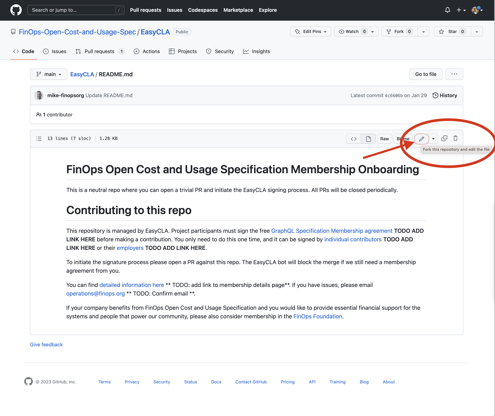
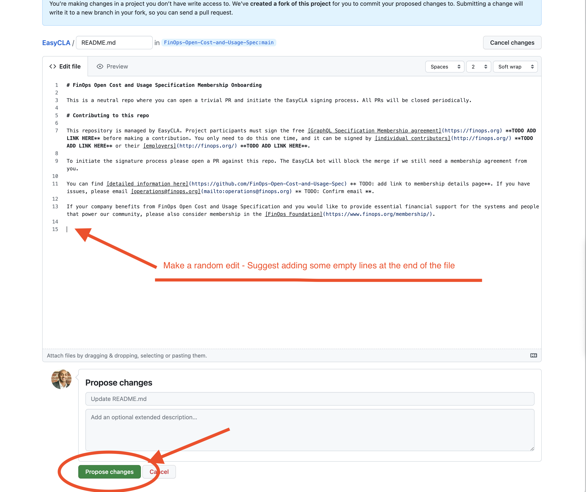
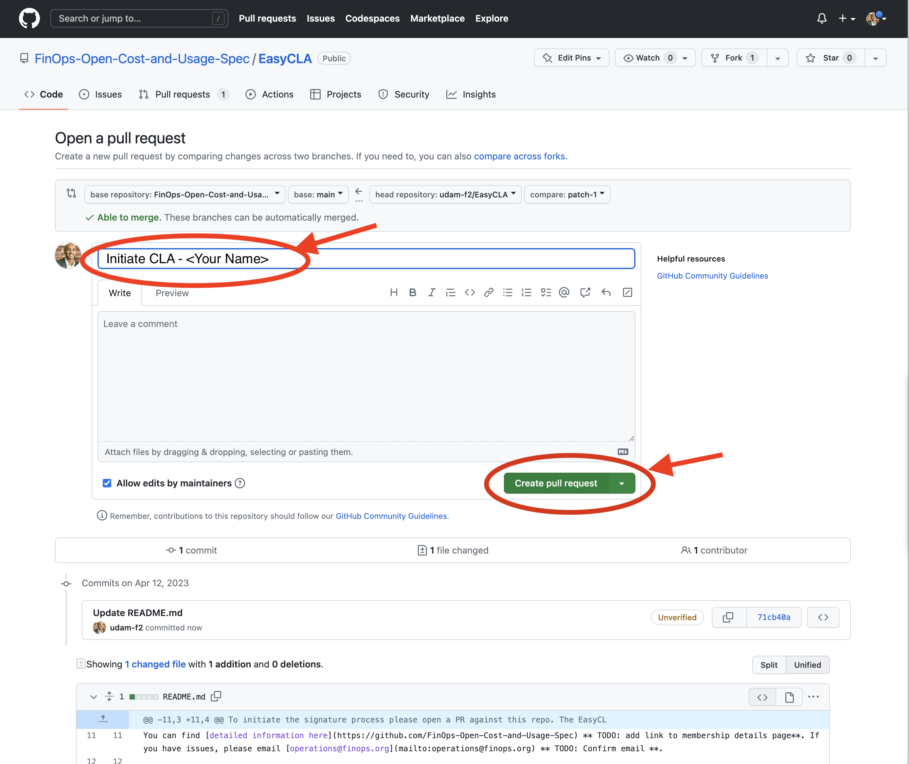
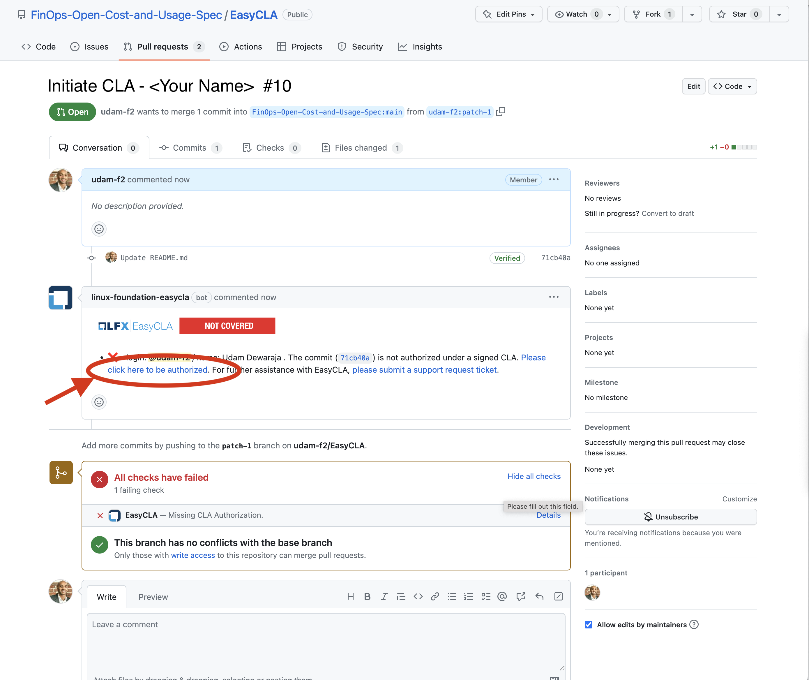
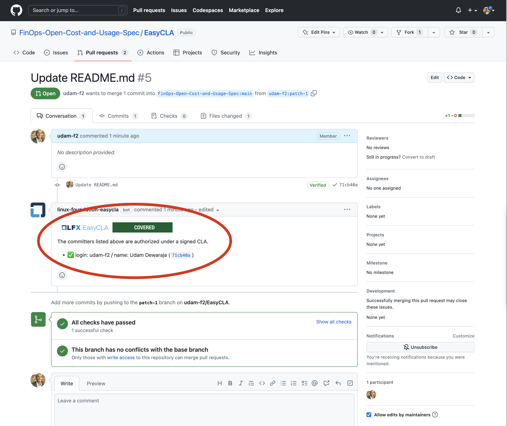

# FinOps Open Cost and Usage Specification Membership Onboarding

This is a neutral repo where you can open a trivial PR and initiate the EasyCLA signing process. All PRs will be closed periodically.

# Contributing to this repo

This repository is managed by EasyCLA. Project participants must sign the free [FOCUS Specification Membership agreement](https://github.com/FinOps-Open-Cost-and-Usage-Spec/foundation/blob/main/FOCUS_-_Membership_Agreement_Package_for_use.pdf) before making a contribution. You only need to do this one time, and it can only be signed by corporations and their employees approved to contribute.

You can find [detailed information here](https://github.com/FinOps-Open-Cost-and-Usage-Spec/foundation). If you have issues, please email [focus@finops.org](mailto:focus@finops.org).
 
To initiate the signature process please open a PR against this repo. The EasyCLA bot will block the merge if we still need a membership agreement from you.

# Steps to trigger CLA signing process

## Step 0 - Setup a GitHub Account and Login

You need to be signed into GitHub using an account registered to your organization email address.

* If you have not done this previously you can [register a new account here](https://github.com/signup)
* Once you have an account [login to GitHub](https://github.com/login)

## Step 1 - Initiate a fork and edit to this repo

In order to trigger the signing process you need to fork this repo and submit a pull request (PR). This sounds like a hard process but luckily the GitHub web interface handles most of the steps for you. 

* Open the following URL [https://github.com/FinOps-Open-Cost-and-Usage-Spec/EasyCLA#readme](https://github.com/FinOps-Open-Cost-and-Usage-Spec/EasyCLA#readme)
* Click on the pencil icon, this will fork the repo into your own GitHub account and allow you to make a change to be submitted back.

## Step 2 - Make a nothing change and Commit

Once you enter the edit screen just make a nothing change to the file, We suggest adding a few empty lines to the end of the file. It is important to note any information you type here will be public so avoid adding any information.

* Add empty lines to the file
* Click on "Propose Changes"

## Step 3 - Create Pull Request (PR)

Now you have a staged commit in your forked repo you can submit a pull request (PR) back to the main FOCUS repo.

* Update the name of your pull request to "Initiate CLA - <Your Name>" - Replace Your name with your actual name ;) 
* Click on "Create Pull Request"

## Step 4 - Find your PR and trigger signing

Now you have opened a PR it will cause the EasyCLA to check on your signing status and enable you to start the signing process.

* Open pull [requests for this repo](https://github.com/FinOps-Open-Cost-and-Usage-Spec/EasyCLA/pulls)
* Find your open pull request in the list and select it
* Check on the status of the EasyCLA add-on, if you are not covered you will need to start the signing process by selecting "click here to be authorized"

## Step 5 - Complete the CLA Signing Process

At this stage you have started the CLA signing process and can follow the documentation provided by the Linux Foundation on the EasyCLA process.

* Follow the steps outlined in the [Linux Foundation Documentation](https://docs.linuxfoundation.org/lfx/easycla/v2-current/contributors/corporate-contributor#github)
* If you are the first to sign up for your organization you will need to get your CLA Manager in your organization to sign first and [setup your organization for signing the CLA](https://docs.linuxfoundation.org/lfx/easycla/v2-current/contributors/corporate-contributor#if-company-has-not-signed)

## Step 6 - Confirm authorization and let us know you are done

Once you have completed the process of signing the CLA and have been added to your organization by your CLA Manager you need to confirm your authorization by doing the signing process one last time.

* Open pull [requests for this repo](https://github.com/FinOps-Open-Cost-and-Usage-Spec/EasyCLA/pulls)
* Find your open pull request in the list and select it
* Check on the status of the EasyCLA add-on, if you are not covered you will need to start the signing process by selecting "click here to be authorized"
* After completing this process you should see you pull request has been authorized
* Let us know you have completed the signing process in [#chat-focus](https://finopsfoundation.slack.com/archives/C034GBRQGGY) so you can be added to the meeting invites and get involved in the FOCUS groups. If you are having trouble accessing this channel email [focus@finops.org](mailto:focus@finops.org)

